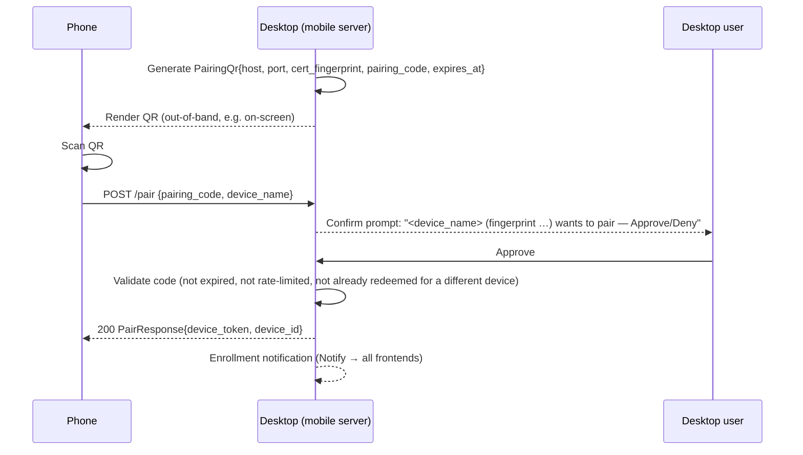
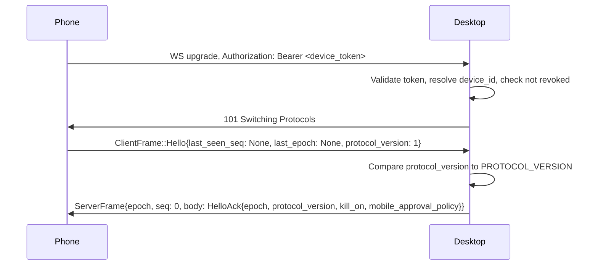
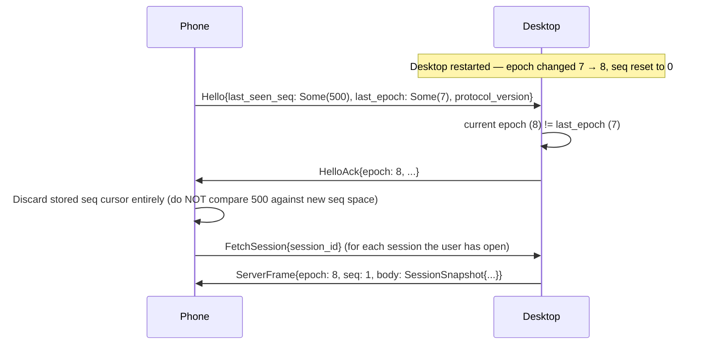

# Haily — Mobile Thin-Client Protocol

Status: v1 (Mobile Thin-Client plan, phase 1). This document and `crates/haily-types/src/mobile/`
are the SAME contract — a serde change in that module is a spec edit here, in the same PR. The
desktop server (P2a) and the mobile Tauri client (P3) each implement one side of exactly what is
described below; neither reads the other's source to know what to send.

## 1. Transport overview

```
┌─────────────┐   HTTP  POST /pair    ┌──────────────┐
│ Mobile app   │ ──────────────────▶  │ Desktop       │
│ (Tauri, Rust │ ◀────────────────── │ mobile server │
│  core)       │  device_token         │ (haily-app)   │
└──────┬───────┘                       └──────┬────────┘
       │  WebSocket (wss://), Authorization: Bearer <device_token>
       │  ClientFrame  ──────────────────────▶
       │  ◀────────────────────────── ServerFrame{epoch,seq,body}
```

- **Pairing** is plain HTTP (`POST /pair`) — deliberately NOT a WS frame, so the server can gate
  token issuance on an out-of-band desktop confirm (§4) before any socket exists.
- **Everything after pairing** is one persistent WebSocket per device connection. The device
  token authenticates the WS **upgrade** via the `Authorization` header — never a frame body,
  never the URL (OWASP WS cheat-sheet).
- The bind policy (which interface the server listens on), TLS setup, and rate limiting are
  server-side concerns specified in the P2a phase file — out of scope here except where they
  shape the wire contract (e.g. the QR carries a cert fingerprint, §4).

## 2. Wire envelope

Every frame the SERVER sends is wrapped in exactly one shape:

```rust
pub struct ServerFrame {
    pub epoch: u64,   // server's per-boot nonce
    pub seq: u64,     // per-connection monotonic counter
    pub body: ServerBody,
}
```

There is no bare/unwrapped server frame. `ClientFrame` (client→server) is NOT wrapped in an
envelope — the client does not need a seq/epoch of its own; ordering and dedup only matter for
what the SERVER delivers.

### 2.1 `epoch` — server restart detection

The seq counter (below) lives in memory and resets to 0 on every server restart. Without a
generation token, a reconnecting client's stored cursor (e.g. `last_seen_seq: 500`) would be
`>=` every seq the freshly-restarted server emits (`1, 2, 3, …`), so the client's own dedup logic
would silently discard every live frame — the app looks connected but renders nothing forever.

`epoch` fixes this: it is a random or monotonic nonce minted once per server process boot,
included in every `ServerFrame` and in the `HelloAck` (§5). On reconnect the client sends its
last-known `epoch` in `Hello.last_epoch`; if the server's current epoch differs, the client MUST
discard its stored seq cursor and treat the connection as a fresh resync (§6.2) rather than
attempt seq-based reconciliation across the boundary — old and new epochs' seq spaces are
unrelated.

### 2.2 `seq` — per-connection, all frame types share it

`seq` is monotonic **per WebSocket connection** (not per session, not per frame-type). A single
writer task on the server owns the connection's outbound buffer and assigns `seq` to literally
every frame it sends — `Chunk`, `Run`, `Notify`, `ProactiveList`, `SessionSnapshot`, `KillState`,
`Pong`, `HelloAck` all consume the same counter. This matters for two reasons:

1. `Hello.last_seen_seq` is a single scalar, not a per-frame-type map — it can only mean anything
   if all frame types share one space.
2. A quiet period with no chat/run traffic must still advance the client's cursor (via `Pong`/
   `KillState`/`HelloAck` consuming a seq slot) — otherwise a client waiting for "the next chat
   seq" cannot distinguish "nothing happened" from "a frame was dropped".

The single-writer task is also the server's ONE serialization point across three independently-
firing delivery callbacks (`deliver`, `deliver_run_event`, `notify_all`) — without it, two
callbacks racing to assign `seq` on the same connection would produce duplicate or out-of-order
sequence numbers. This is a P2a implementation detail; documented here because it is the
invariant the client's replay/dedup logic is allowed to assume.

## 3. Frame catalogue

### 3.1 `ServerBody` (server → client, inside `ServerFrame`)

| Variant | Fields | Meaning |
|---|---|---|
| `HelloAck` | `epoch, protocol_version, kill_on, mobile_approval_policy` | Handshake reply. |
| `Chunk` | `session_id, chunk: ResponseChunk` | One streamed turn chunk — reuses the GUI's exact `ResponseChunk` shape. |
| `Run` | `session_id, event: RunEvent` | One pipeline run event — reuses the GUI's exact `RunEvent` shape. |
| `Notify` | `Notification` | Daemon-wide notification (morning brief, alert, reminder, distillation proposal). |
| `ProactiveList` | `Vec<ProactiveCard>` | Reply to `FetchProactive`. |
| `SessionSnapshot` | `SessionSnapshot` | Reply to `FetchSession` — see §6.3. |
| `KillState` | `on: bool` | Kill-switch state changed — broadcast to ALL frontends (global, §8.5). |
| `Error` | `MobileError` | A post-connect error (see §7's error table). |
| `Pong` | — | Reply to `Ping`. |
| `Unknown` | `type_tag: String` | Forward-compat sentinel — see §9. Never sent by the server; only produced by an old client's decoder. |

`ServerBody::Chunk` and `::Run` carry the EXACT same `ResponseChunk`/`RunEvent` types the GUI
adapter uses (`haily-types::{ResponseChunk, RunEvent}`) — mobile renders identically to the
desktop for the same underlying event, with no parallel "mobile chunk" type to keep in sync.

### 3.2 `ClientFrame` (client → server, no envelope)

| Variant | Fields | Meaning |
|---|---|---|
| `Hello` | `last_seen_seq: Option<u64>, last_epoch: Option<u64>, protocol_version: u16` | First frame after connect. `None`/`None` on a fresh pairing or first-ever connect. |
| `UserMessage` | `session_id, message, depth` | A chat turn. `depth` defaults to `Normal`. |
| `Approve` | `approval_id, session_id, approved, biometric_ok` | Resolves a pending `ToolApprovalRequest`. |
| `SetKillSwitch` | `session_id, on` | Toggles the kill switch. **ENABLE-ONLY from mobile** — see §8.1. |
| `FetchProactive` | `session_id` | Requests the current proactive-card list. |
| `FetchSession` | `session_id` | Requests a `SessionSnapshot` — see §6.3. |
| `CancelTurn` | `session_id` | Cancels `session_id`'s in-flight turn. **Added in phase 3** (additive, no `PROTOCOL_VERSION` bump — see §9); a server predating this variant already degrades an unrecognized `type` tag to its own decode fallback, so no coordinated rollout was required. |
| `Ping` | — | Keepalive; server replies `Pong`. |
| `Unknown` | `type_tag: String` | Forward-compat sentinel (§9), symmetric with `ServerBody::Unknown`. |

**Every session-scoped frame — `UserMessage`, `Approve`, `SetKillSwitch`, `FetchProactive`,
`FetchSession`, `CancelTurn` — carries `session_id`, not just `Approve`.** The server MUST verify
`session_id ∈` the authenticated device's set of sessions on every one of these, not only on
`Approve`. A device that has been unpaired or a `session_id` that belongs to a different device
must be rejected the same way regardless of which frame type carried it.

The device token authenticates the WS **upgrade**; it does not re-appear in any frame. Frame-level
auth is entirely `session_id`-scoped, checked against the device identity bound to the connection
at upgrade time.

**v1 is single-active-device-per-session, not full multi-device (P2a review finding 4):** a
`session_id` is claimed by whichever device FIRST uses it (first-use-wins, `TOFU`) and stays
bound to that device for as long as the server process runs — a second device presenting the
same `session_id` is rejected with `SessionUnknown`, exactly like an unpaired/foreign device
would be. This is NOT "every paired device can see every session"; it is "one session belongs to
exactly one device, permanently, until that device is revoked or the server restarts" (revocation
evicts the claim so the `session_id` becomes claimable again — see `MobileAdapter::disconnect_device`
in P2a). A future multi-device-per-session model (e.g. a shared household session two phones can
both see) is out of scope for this plan and would need an explicit design, not an accidental
side effect of the first-use-wins rule.

## 4. Pairing sequence (HTTP)



- The QR alone is **not sufficient** to pair — a photographed/leaked QR still requires the desktop
  user to explicitly approve the out-of-band confirm prompt (M4). No token is issued on
  `PairRequest` receipt alone.
- `pairing_code` is single-use and expires after **2 minutes** (`PairingQr.expires_at`) — a
  scan-then-tap-confirm flow takes seconds, so this is generous, not tight.
- **Idempotent redemption within the code's TTL:** if the phone's `POST /pair` response is lost in
  transit (e.g. connection drop) and it retries with the SAME `pairing_code` before it expires,
  the server returns the SAME `device_token`/`device_id` rather than minting a second device row
  or rejecting the retry as "already used". A code is only truly consumed once its TTL elapses.
- `cert_fingerprint` lets the phone pin the desktop's TLS certificate before the first WS
  connect — the client MUST refuse to connect if the certificate presented at TLS handshake time
  does not match. Regenerating the desktop's certificate invalidates every paired device's pin;
  affected devices show a **"desktop identity changed — re-pair"** banner, distinguishable in
  copy/tone from a generic certificate-mismatch attack warning (both are the same underlying
  check, but the UX must not cry wolf on a routine cert rotation).
- Failure responses use `MobileError` (§7): `PairingCodeInvalid`, `PairingCodeExpired`,
  `PairingRateLimited` (too many attempts against one code or from one source), `PairingNotConfirmed`
  (desktop user has not yet responded to / has denied the prompt).

## 5. Handshake



- A revoked/unknown device token fails the upgrade itself (HTTP 401-equivalent close) — the
  client never reaches `Hello`.
- `HelloAck.epoch` is the value the client must remember for future reconnects.
- `HelloAck.protocol_version` is this boot's negotiated version; the client compares it to its own
  compiled `PROTOCOL_VERSION` per §9's hard-block policy.
- `HelloAck.kill_on`/`mobile_approval_policy` seed the client's initial UI state without a
  separate round-trip.

## 6. Resume semantics

### 6.1 Normal resume (same epoch)

On reconnect, the client sends `Hello{last_seen_seq: Some(n), last_epoch: Some(e), protocol_version}`.
If `e` equals the server's current epoch, the server replays every buffered frame with
`seq > n` from the connection's ring buffer, then resumes live delivery. The ring buffer is
bounded (overflow drops the oldest entries — an intentional, documented deviation from the GUI
adapter's never-drop contract, since a flaky mobile link must never stall the desktop runner);
if the requested `n` is older than the buffer's oldest retained seq, this becomes the
resume-window-exceeded case (§6.3).

### 6.2 Epoch mismatch → full resync



An epoch mismatch is NOT an error — it is the expected, correct signal that the seq spaces are
unrelated. The client must not attempt to interpret `last_seen_seq` against the new epoch's
counter; it resets to "no cursor" and treats every subsequently open session as needing a fresh
`FetchSession`.

### 6.3 `FetchSession` / `SessionSnapshot` — resume-window-exceeded recovery

Before this frame pair existed, the only recovery frame was `FetchProactive` — sufficient for the
proactive-card list, but chat/turn state (transcript, latest run outcome) had no recovery path at
all once the ring buffer's window was exceeded (M7). `FetchSession{session_id}` is the fix:

```rust
pub struct SessionSnapshot {
    pub session_id: Uuid,
    pub transcript: Vec<TranscriptEntry>,   // chronological, bounded
    pub latest_run_status: Option<String>,  // last RunEvent::RunComplete.outcome, if any
    pub depth: DepthMode,                   // depth in effect for this session
}
```

Built from the same session-transcript seam the ACP channel already uses
(`haily-app::session_transcript::DbSessionTranscript`, phase 12) — a second consumer of an
existing bounded read, not a new persistence path. The client requests this:

- After an epoch mismatch (§6.2), for every session it has open.
- After a normal resume (§6.1) where the server reports `MobileError::ResumeWindowExceeded`
  instead of replaying (the client's `last_seen_seq` predates the ring buffer's oldest entry).

A client that receives a `SessionSnapshot` MUST replace its local transcript/run-status view
wholesale for that `session_id` rather than attempt to merge/append — the snapshot is a complete
replacement, not a delta.

## 7. Error codes

`MobileError` is returned either as an HTTP body (pairing) or as `ServerBody::Error` (post-connect):

| Code | Where | Meaning |
|---|---|---|
| `PairingCodeInvalid` | `POST /pair` | Code does not exist or was never issued. |
| `PairingCodeExpired` | `POST /pair` | Code's 2-minute TTL elapsed. |
| `PairingRateLimited` | `POST /pair` | Too many pairing attempts. |
| `PairingNotConfirmed` | `POST /pair` | Desktop user has not yet approved (or denied) the OOB prompt. |
| `AuthRejected` | WS upgrade | Device token invalid, expired, or revoked. |
| `SessionUnknown` | Any session-scoped frame | `session_id` does not belong to this device, or does not exist. |
| `ProtocolVersion` | WS upgrade / `Hello` | Envelope-structure mismatch — see §9's hard-block policy. |
| `ResumeWindowExceeded` | `Hello` resume | `last_seen_seq` predates the ring buffer's retained window — client must `FetchSession`. |
| `Internal` | Anywhere | Unclassified server-side failure. |

This is a closed enum (no `Unknown` arm) — unlike the frame types, a client that doesn't recognize
a new error code can still render a generic "something went wrong", which is a UX nit, not the
silent-data-loss failure mode `Unknown` frame handling exists to prevent (§9).

## 8. Threat model

### 8.1 Remote operator authority on a stolen phone (M1)

Mobile resolves `ToolApprovalRequest`s through the same approval broker the desktop GUI uses, and
can (per the frame catalogue) send `SetKillSwitch`. Without mitigation, whoever holds an
**unlocked, paired** phone inherits full Safe-Operator human-in-the-loop authority — a strictly
worse security posture than "physical access to the desktop required".

Mitigations (mandatory, not implementor discretion):

1. **Biometric-gated High/IrreversibleWrite approvals.** `Approve.biometric_ok` reports whether
   the phone's own OS-level biometric/passcode prompt succeeded immediately before the frame was
   sent. The desktop preference `mobile_approval_policy` decides enforcement:
   - `allow` — no extra gate (opt-in, least safe).
   - `biometric-required` (**default**) — an `Approve` for a `High`/`IrreversibleWrite` tool with
     `biometric_ok == false` is treated as a deny, not honored as approve.
   - `deny-irreversible` — remote can never approve an `IrreversibleWrite` tool regardless of
     `biometric_ok`; only the desktop GUI/CLI can.
2. **`SetKillSwitch` is ENABLE-ONLY from mobile.** The server MUST reject `on: false` from a
   mobile connection outright — disabling the kill switch (resuming normal operation) requires
   the desktop. A stolen phone can make Haily MORE cautious, never less.

### 8.2 Data-at-rest on the phone (M5)

v1 keeps transcripts, proactive cards, and any other session data **in memory only** on the
phone — nothing is written to disk. Anything persisted in a future version MUST use OS-level
protected storage (iOS Keychain-backed storage / Android Keystore-backed storage) and MUST be
cleared on unpair. This is a first-class v1 constraint, not a placeholder for "later" — there is
no disk-persistence code path to audit because there is no disk-persistence code path.

### 8.3 WebView network isolation (M14)

The mobile Tauri shell's WebView (the SvelteKit frontend rendered inside it) has **no** ability to
open its own network sockets. `tauri.conf.json`'s CSP is `connect-src 'self' ipc: http://ipc.localhost`
— no `ws:`, `wss:`, or remote `http(s):` origins. The actual WebSocket connection to the desktop
server lives entirely in the mobile app's Rust core; the WebView only ever talks to that core over
Tauri's local IPC. This closes off a class of bug where a future dependency or a compromised web
asset opens an unpinned, unauthenticated socket directly from JS — there is structurally nothing
in the WebView's network capability to abuse. CI enforces this with a grep-guard rejecting
`new WebSocket(` / remote-URL `fetch(` calls under the mobile route group (P3).

### 8.4 Man-in-the-middle on first connect (researcher-03 §4)

The pairing QR carries the desktop's TLS certificate fingerprint (§4); the client pins it and
refuses to connect on a mismatch. This closes the "attacker on the same coffee-shop Wi-Fi
intercepts the very first connection" gap that TOFU (trust-on-first-use) alone would leave open.

### 8.5 Kill switch is intentionally global (M15)

Flipping the kill switch from ANY frontend — desktop GUI, Telegram, CLI, or mobile — affects
every channel simultaneously. This is a deliberate design property, not a cross-channel isolation
bug: the kill switch models "stop Haily from taking real-world actions", a property of the single
underlying agent, not of any one channel. `ServerBody::KillState` and the equivalent
`Notification`/watch-channel broadcast on other adapters keep every frontend's displayed state
consistent with this shared reality.

### 8.6 Expired approvals replay as dead modals

Approvals deny-on-timeout at 120 seconds (existing desktop behavior). A mobile client that
reconnects after being backgrounded may receive a replayed `ToolApprovalRequest` for an approval
that already expired server-side. The server reconciles replay against its live pending-approval
set before resending — a dead approval is rewritten/suppressed as an inert "expired — action was
declined" notice, never re-presented as an actionable modal. **This means a backgrounded phone
silently declines destructive actions once 120 seconds elapse** — documented behavior, not a bug
to "fix" by extending the timeout for mobile specifically.

## 9. Version negotiation policy (C3)

`ResponseChunk`/`RunEvent` are closed, tag+content enums with no catch-all internally — a brand
new variant would hard-fail an old client's decode if sent bare. Given app-store update lag is
inevitable (a user's phone can run an old client for months against an upgraded desktop), the
wire types cannot rely on lockstep versions.

**Policy:**

- `PROTOCOL_VERSION` (currently `1`) is bumped **only** for an envelope-STRUCTURE change: adding,
  removing, or retyping a field on `ServerFrame`/`ClientFrame` themselves, or changing the
  tag/content wire shape. The server advertises its `PROTOCOL_VERSION` in `HelloAck`; a mismatch
  here is the ONLY case that hard-blocks with `MobileError::ProtocolVersion` and refuses the
  connection.
- A NEW `ServerBody`/`ClientFrame` **variant** (e.g. a future frame kind) is NOT a version bump.
  An old client decodes it via the `Unknown { type_tag }` fallback (§10) and renders an inert
  "unsupported event" placeholder — it keeps working, just without understanding the new frame.
- This means: rolling out a new frame kind never requires a coordinated client release; rolling
  out an envelope change (rare) does, and is the only thing that should ever increment
  `PROTOCOL_VERSION`.

## 10. Forward-compat decode (`Unknown`, C3)

`#[serde(other)]` was tried first for the frame-catalogue enums and rejected — verified by a
throwaway probe test: serde requires the `other` arm to be a **unit variant**, and the moment an
unrecognized tag's `data` is a non-empty JSON object, deserializing into a unit variant errors
(`"invalid type: map, expected unit variant"`). A genuinely-new variant, by definition, carries a
`data` shape the current decoder has never seen — so `#[serde(other)]` cannot be the whole
mechanism.

The actual mechanism (`crates/haily-types/src/mobile/{server_body,client_frame}.rs`): each public
enum (`ServerBody`, `ClientFrame`) has a hand-written `Deserialize` that:

1. Buffers the incoming frame as a generic JSON value.
2. Attempts to decode it against a private "known" mirror enum (identical variants, ordinary
   derived `Deserialize`, no `Unknown` arm).
3. On success, maps 1:1 into the public enum.
4. On ANY failure — unrecognized tag, or a recognized tag whose `data` shape changed
   incompatibly — falls back to `Unknown { type_tag }`, capturing only the tag string for
   logging/telemetry. The `data` payload is discarded, never partially interpreted.

`Serialize` is derived normally on the public enum — the server/client only ever encodes a KNOWN
variant, so there is no equivalent ambiguity on the write side.

A CI test (P6) enforces that adding a wire-enum variant without a corresponding render arm on at
least one client target fails the build — preventing "we shipped a new server frame and nobody
remembered to teach any client about it" from shipping silently.

## 11. Approval round-trip

```mermaid
sequenceDiagram
    participant Server as Desktop (broker)
    participant Phone

    Server->>Phone: ServerFrame{seq, body: Chunk{session_id, chunk: ToolApprovalRequest{tool, args, approval_id, reversible: false}}}
    Phone->>Phone: Render approval UI; tool is High/IrreversibleWrite → require biometric first
    Phone->>Phone: OS biometric/passcode prompt succeeds
    Phone->>Server: ClientFrame::Approve{approval_id, session_id, approved: true, biometric_ok: true}
    Server->>Server: mobile_approval_policy == biometric-required AND biometric_ok == true → honor approval
    Server->>Phone: ServerFrame{seq, body: Chunk{session_id, chunk: ToolResult{...}}}
```

If `biometric_ok` were `false` for a `High`/`IrreversibleWrite` tool under the default
`biometric-required` policy, the server treats the `Approve` as a deny regardless of `approved`'s
value — the phone's own attestation of its biometric check is the gate, not a separate
round-trip.

## 12. Revocation forces disconnect

```mermaid
sequenceDiagram
    participant User as Desktop user
    participant Server
    participant Phone

    User->>Server: Revoke device (Devices panel)
    Server->>Server: Mark device_id revoked; cheap cached "revoked" flag checked per session-scoped frame (not only at upgrade)
    Server->>Phone: Close WS connection
    Phone->>Server: (any reconnect attempt) WS upgrade, Authorization: Bearer <old token>
    Server->>Phone: Reject upgrade — AuthRejected
```

Revocation is enforced on LIVE sockets, not only at the next upgrade attempt: the server checks a
cheap cached revoked flag on every session-scoped frame from an already-connected device, so a
revoked device's in-flight connection is closed promptly rather than left open until its next
reconnect.

## 13. Related documents

- `.agents/260712-1831-mobile-thin-client/plan.md` — overall plan, phase links.
- `.agents/260712-1831-mobile-thin-client/reports/red-team-findings.md` — the review this spec
  encodes findings from (sections C3, C4, M1, M4, M5, M7, M8, M14, M15, m1 are non-negotiable
  invariants here, not implementor discretion).
- `crates/haily-types/src/mobile/` — the executable half of this contract.

## 14. Changelog

- **Phase 3 review (cross-phase amendment):** added `ClientFrame::CancelTurn { session_id }`
  (§3.2). Additive per §9's version-negotiation policy — no `PROTOCOL_VERSION` bump. The server
  resolves it through a new `haily_types::TurnCanceller` seam (`Adapter::set_turn_canceller`,
  injected by `haily-app::bootstrap` from the existing `TurnRegistry`), session-bound like every
  other session-scoped frame. Logged in both `phase-01-protocol-spec.md`'s and
  `phase-03-mobile-shell.md`'s Deviation Log (cross-referenced).
